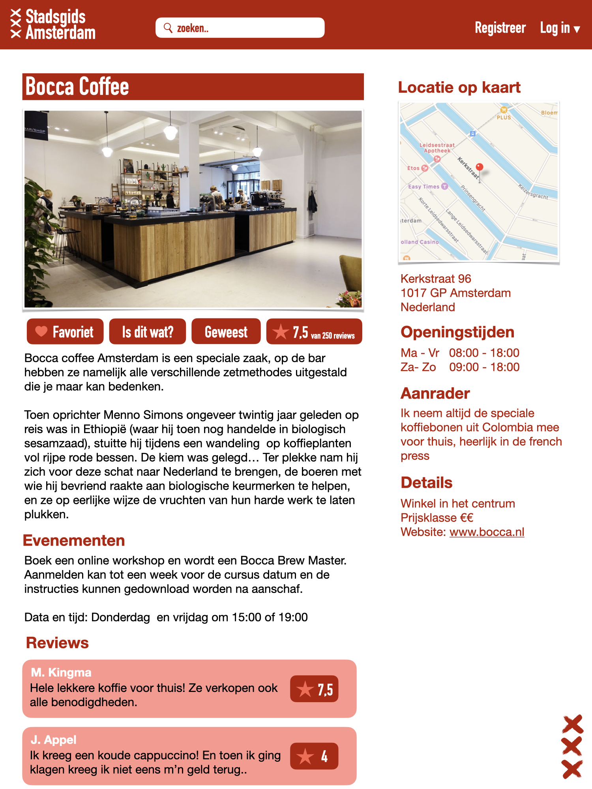

# Designdocument voor Stadsgids Amsterdam

## Features
Functie | Openbaar | Registratie vereist | MVP
--------|----------|---------------------|----
Overzicht verschillende locaties in Amsterdam onderverdeeld naar soort en prijsklasse | X | | X
Geavanceerd zoeken waarbij in het zoekveld adressen, maar ook andere specifieke zoektermen kunnen worden gebruikt zoals "pizza in amsterdam oost" of "afhaalrestaurant in de spuistraat" | X | | X
Gemiddelde score reviews van Google Places API | X | | X
Toon locatie op kaart | X | | X
Nieuwsblog index-pagina | X | |
'Voor het weekend' evenementen | | X |
Wekelijkse vrijmibo-locatie op index-pagina | | X |
Locatie-pagina met informatie, link naar website, gemiddelde externe ratings, prijslkasse en openingstijden | X | | X
Aanbevelingen van auteur, gemiddelde eigen ratings, evenementen en gerelateerde locaties op locatie-pagina | | X | X
Locatie toevoegen aan favorieten | | X | X
'Is dit wat?' voor het aanvragen van meer informatie over een locatie | | X | X
Locatie beoordelen | | X | X
Reacties van andere gebruikers bekijken en beoordelen | | X | X
Accountbevestiging via e-mailverificatie | X | | X
Wachtwoord-vergeten service | X | | X

## User interface

Design homepagina persoonlijke site

Design homepagina stadsgids site

Design login menu stadsgids site

Design locatiepagina stadsgids site

## Database

Database design met relaties

## Lists of dataspurces and API's
Functie | Api/framework
--------|---------------
Zoeken locaties | Google places search API
Externe reviews | Google places details API
Advanced search | Google places nearby search API
Tonen op kaart | Google maps embed API
Tonen prijsklasse, openingstijden | Google places details API
E-mail bevestiging en wachtwoord vergeten | Flask-mail

## Routes
Route | Functie
------|--------
logout | Uitloggen gebruiker
deletereview | Verwijderen review gebruiker van huidige locatiepagina
reset | Verwerken van verzoek opnieuw instellen wachtwoord
usernamecheck | Controle voor beschikbaarheid gebruikersnaam bij registreren
emailcheck | Controle voor beschikbaarheid e=mailadres bij registreren
new_conformation | Verwerken aanvraag nieuwe link voor bevestigen e-mailadres
action_location | Verwerken verschillende AJAX-requests van de locatie pagina
index | Weergeven homepagina persoonlijke site
contact | Weergeven contactpagina persoonlijke site
guide | Weergeven homepagina stadsgids
register | Weergeven en verwerken registratie
not_confirmed | Weergeven pagina aanvraag bevestigingslink wanneer bevestigingslink ongeldig
confirm_email | Verwerken bevestiging na klikken bevestigingslink
forgot | Wergeven en verwerken aanvraag wachtwoordvergetenlink
resetpass | Weergeven pagina wachtwoord opnieuw instellen na klikken bevestigingslink
location | Weergeven locatie met informatie uit API en database (Recommendation, Favourites, Reviews, Requests, Upvotes)
new | Overzichtspagina nieuw toegevoegde aanbevelingen
search | Weergeven resultaten, geavanceerd zoekformulier, verwerken zoekopdrachten voor normaal en geavanceerd zoeken
weekend | Overzicht evenementen locaties per weekend
profile | Overzicht gebruiker met favorieten, requests en recensies
dashboard | Pagina voor beheerder voor toevoegen van aanbevelingen, checken reacties, toevoegen weekend-evenementen, blogposts en vrijmibo tips
controlnew | Overzichtpagina beheerder voor aanbevelingen, aanbevelingen bewerken
createnew | Beheerderspagina voor aanmaken nieuwe aanbeveling
changenew | Beheerderspagina voor aanmaken bestaande aanbeveling
newsletter | Beheerderspagina voor beheren nieuwsbrief
createnewsletter | Beheerderspagina aanmaken nieuwsbrief
check | beheerderspagina controleren reacties
