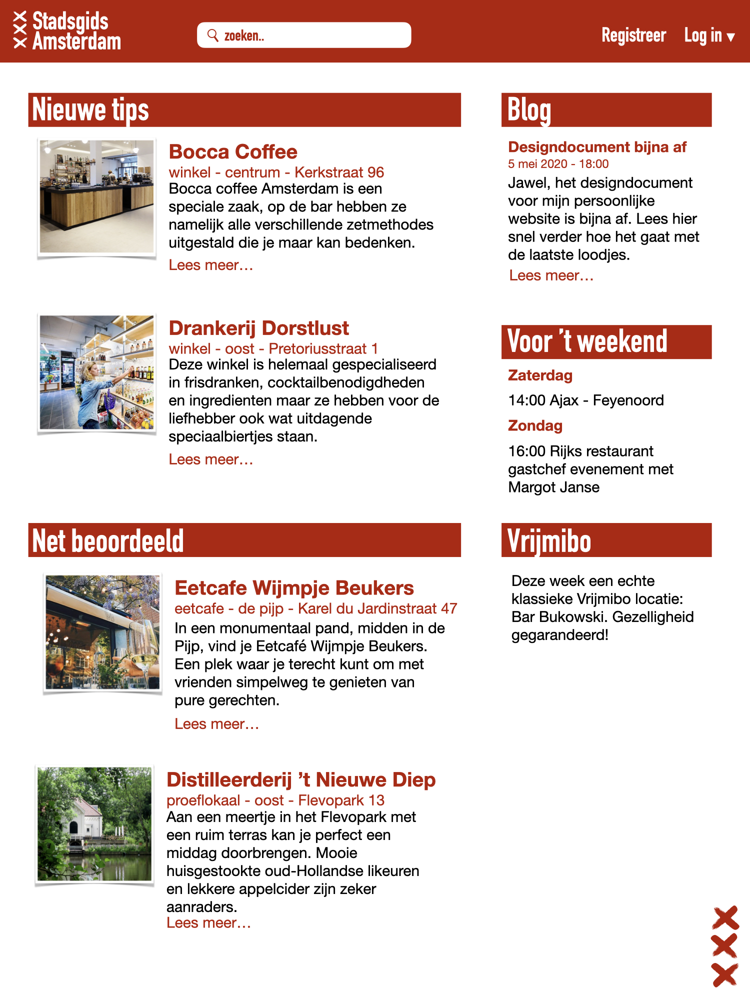
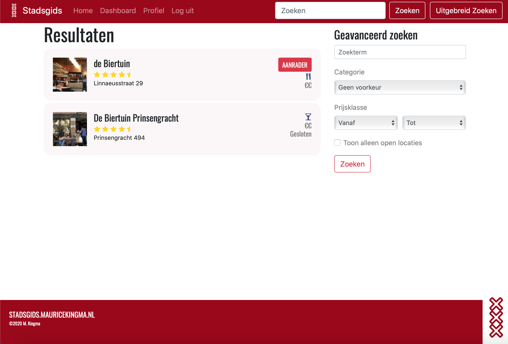
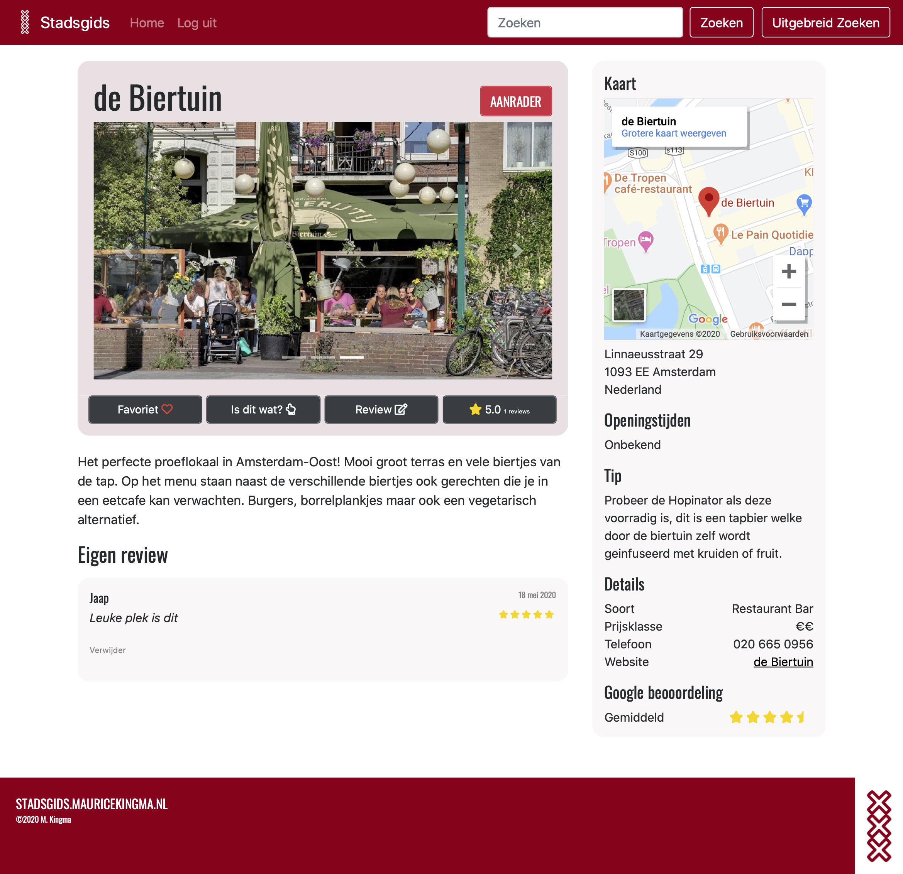

# Naam applicatie

Stadsgids Amsterdam

## Probleembeschrijving

Ikzelf werk al heel wat jaren in de horeca en heb in amsterdam ook al in 5 verschillende grote horecazaken gewerkt. Ook ga ik zelf ook graag uit eten en weet ik vele kleine restaurants maar ook koffietentjes en ontbijtplekken te vinden. Omdat ik redelijk op de hoogte ben hier in Amsterdam krijg ik veelvoudig per maand wel berichten van vrienden en kennissen van binnen en buiten amsterdam met de vraag of ik nog een leuk tentje weet om te gaan eten of waar ze lekkere koffie voor thuis kunnen halen. Iedere keer ben ik dan weer een minuut of tien bezig om wat aanbevelingen naar voren te halen uit mijn geheugen en vervolgens een berichtje terug te sturen. En iedere keer dat ik dit weer doe zeg ik tegen mezelf dat dit toch echt makkelijker moet kunnen.

## Oplossing

Als oplossing heb ik en webapp in gedachten waarmee mensen gemakkelijk op ideen kunnen komen over wat ze in amsterdam kunnen doen. Restaurants, cafes, koffiebranders, bierbrouwerijen, wijnwinkels, barbequeplekjes, bakkers en nog veel meer zijn hier allemaal te vinden. Onder te verdelen in stadsdeel, prijsklasse en ratings (zowel van de app als van externe sites). Het is mogelijk om veel informatie te zien op het openbare gedeelte van de app, maar als de gebruiker registreerd en inlogd zijn er nog meer mogelijkheden. Zo kan de gebruiker zich inschrijven voor de wekelijkse nieuwsbrief, hij kan plekken toevoegen aan zijn of haar favorieten zodat je overzichtelijk kan maken waar je nog heen wil. Ook is het mogelijk aan te geven of je van plan bent ergens naar toe te gaan en meer informatie te krijgen of deze plek het bezoek waard is wanneer er geen gedetailleerde infomratie over de locatie beschikbaar is.

Op de guide-pagina (homepagina) kan men nieuwe toevoegingen vinden in de database welke in een lijst staan opgesteld. Ook kan men gedurende de week kijken welke speciale evenementen er in het weekend gepland zijn en is er een aanbeveling voor een vrijmibo-locatie die iedere week automatisch wordt gegenereerd uit de database.

Op een locatie-pagina vind je gedetailleerde infomatie, kan je een routebeschrijving in Google maps openen en kan je aanbevelingen van de auteur vinden. Je vind hier ook verschillende knoppen om de locatie toe te voegen aan je favorieten en recensies te plaatsen. Ook kan je als gebruiker bij recensies van andere gebruikers aangeven dat deze recensie nuttig is.

Registreren van gebruikers gaat voor het overgrote deel via flask-login. De verschillende rollen voor gebruikers worden ook via deze extensie verwerkt. Bij het registreren moet ook het emailadres worden geverifieerd via email. Deze emails en de nieuwbrief worden via flask-mail verstuurd. Mocht de gebruiker bij het inloggen het wachtwoord zijn vergeten dan is er de mogelijkheid om een nieuw wachtwoord in te stellen. Dit gaat ook via een link die per mail wordt verstuurd.

Het opstellen van een nieuwsbrief en het beoordelen van gebruikersrecensies gaat via een adminomgeving in de app. Het is in deze omgeving makkelijk gemaakt voor het toevoegen van aanbevelingen van locaties en het toevoegen van missende informatie voor de locaties (prijsklasse en openingstijden).

## Details and schetsen

In onderstaande tabel is te zien welke functies openbaar zijn en welke functies alleen beschikbaar zijn wanneer de gebruiker is geregistreerd en ingelogd.

Functie | Openbaar | Registratie vereist
--------|----------|--------------------
Overzicht verschillende locaties in Amsterdam onderverdeeld naar soort en prijsklasse | X |
Geavanceerd zoeken waarbij in het zoekveld adressen, maar ook andere specifieke zoektermen kunnen worden gebruikt zoals "pizza in amsterdam oost" of "afhaalrestaurant in de spuistraat" | X |
Gemiddelde score reviews van Google Places API | X |
Toon locatie op kaart | X |
Nieuwsblog index-pagina | X |
'Voor het weekend' evenementen | | X
Wekelijkse vrijmibo-locatie op index-pagina | | X 
Locatie-pagina met informatie, link naar website, gemiddelde externe ratings, prijslkasse en openingstijden | X |
Aanbevelingen van auteur, gemiddelde eigen ratings, evenementen en gerelateerde locaties op locatie-pagina | | X
Locatie toevoegen aan favorieten | | X
'Is dit wat?' | | X
Locatie beoordelen | | X
Reacties van andere gebruikers bekijken en beoordelen | | X
Accountbevestiging via e-mailverificatie | X |
Wachtwoord-vergeten service | X |

### Onderstaand een design van de index-pagina

### Onderstaand een screenshot van de resultaten-pagina

### Onderstaand een screenshot van de locatie-pagina

### Screencast

## Prerequisitie

De Google Places API ga ik gebruiken om data over restaurants en winkels in amsterdam te verkrijgen. Alle locaties kunnen worden opgezocht via de site. Aanbevolen locaties door de auteur krijgen een meer prominente plek op de website en zijn ook te herkennen aan een soort label bij zoekopdrachten. Voor alle locaties kan men informatie zoals adressen of openingstijden makkelijk vinden. Voor het "normale" zoeken gebruik ik de Google places search API. Voor de "geavanceerde" zoekopdrachten gebruik ik de Google places nearby search API waarbij je als zoektermen veel meer mogelijkheden hebt en daarnaast ook kan filteren op soort, openingstijden of prijsklasse.

De externe componenten die ik denk te gebruiken zijn de bootstrap layout componenten, de media-list en de bootstrap javascript validator. Verder gebruik ik SQalchemy voor de database, Heroku, flask-login, flask-mail.

De uitdaging voor mij ligt in het feit dat ik met deze applicatie de flask-mail en de flask-login extensies volledig en correct wil gebruiken. Daarnaast wil ik in dit project de rollen van de verschillende gebruikers beter implementeren en de pagina's voor bepaalde rollen beveiliggen door middel van het schrijven van een eigen decorator. Ook wil ik het inlog en registratieformulier validaties naast de serverside volledig uitwerken met Javascript op de client side. Voor de locatiepagina wil ik de bestaande informatie van de API vervangen als ik zelf een prijsklasse of openingstijden aan de locatie in mijn database heb toegevoegd. Heel veel verschillende informatiestromen en variabelen komen dus samen op de locatiepagina. Ik denk dat het ook een hele klus wordt om deze pagina goed te laten werken.

## Vergelijken met andere apps

De vergelijking met een app als tripadvisor is snel gemaakt, alleen ik probeer deze app onderscheidend te maken om juist de aanbevelingen van de lokale en onbekendere plekken in amsterdam echt prominenter weer te geven. Het is de bedoeling dat mensen via deze site echt nieuwe plekken ontdekken in een stad met zo veel mogelijkheden. Juist door een goed samengestelde lijst van onbekende plekken in plaats van het rangschikken van alle plekken op basis van honderden gebruikersreviews die tegenwoordig simpelweg te koop staan op het internet. Hetzelfde kan eigenlijk worden gezegd over alle andere applicaties/sites die mensen helpen zoeken naar een restaurant of koffiezaakje. Hoe meer je betaald aan google, hoe hoger je in de zoekresultaten komt. The Fork (voorheen Iens) vraagt inschrijvingsgeld aan restaurants en laat hoe dan ook het gemiddelde eindcijfer gebaseerd op de reviews nooit een onvoldoende zijn. Met al deze apps kom je eerder bij een toeristenrestaurant uit en geven naar mijn mening niet genoeg aandacht aan de kleine speciaalzaken en buurtcafes en restaurants.